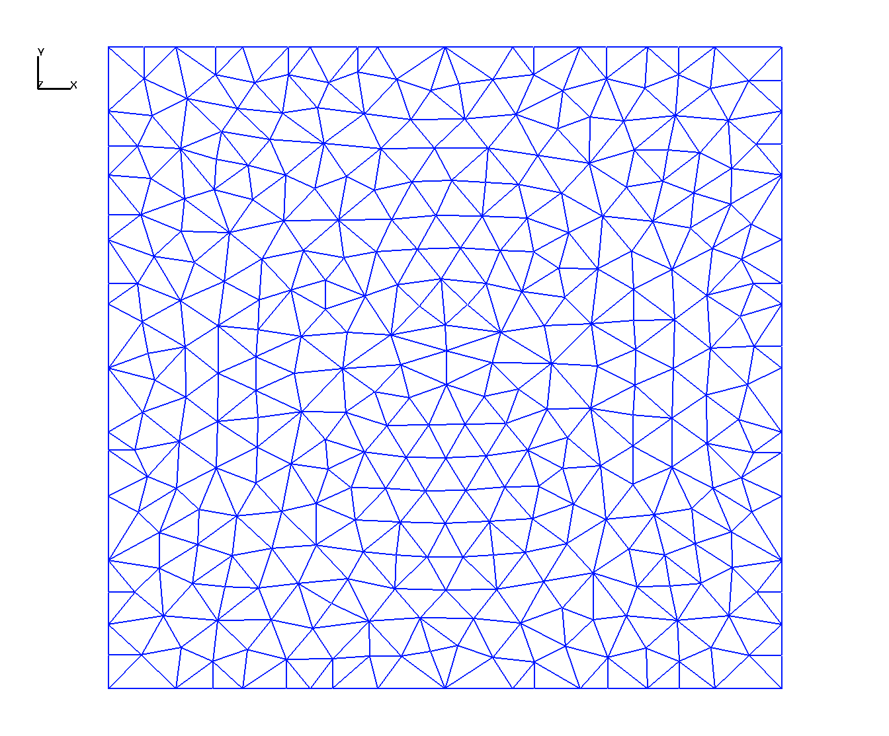
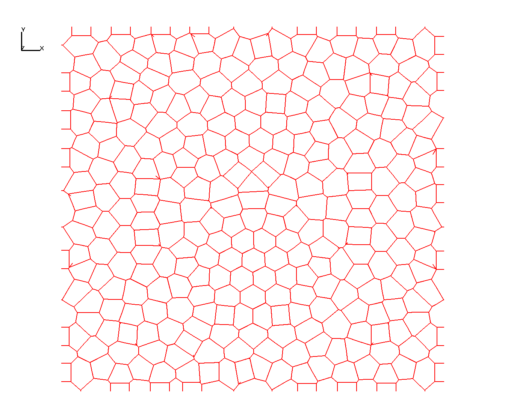
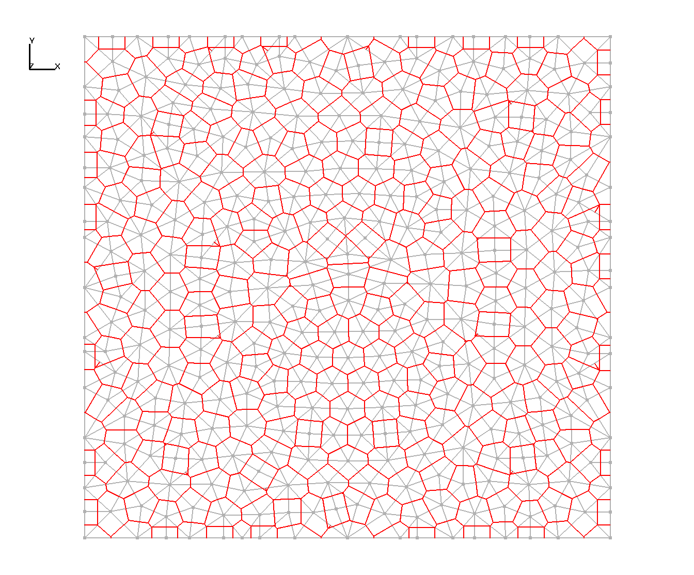

# Image Gallery 

Gallery written: Tue Jul  2 11:32:33 2019

Image Directory: /project/meshing/GEO_Integration/repos/GeologicMeshing/GDSA/Cube_Test01/images

|  |  |  |   | 
| :---: | :---: | :---: | :---:  | 
|  |  |  |   | 
|  **gfm_gocad_ex** |  **gfm_gocad** |  **surfmesh_all_clip** |  **surfmesh_gfm_clip**  | 
|  |  |  |   | 
|  **surfmesh_gfm** |  **tet_delaunay_ex** |  **tet_delaunay** |  **tet_vorvol**  | 
|  |  |  |   | 
|  **tri2_delaunay** |  **tri2_delaunay_vor** |  **tri2_delaunay_vor_tri** |  **vorocrust_non_manifold_off**  | 
|  |  |  |   | 
|  **vorocrust_R0.5** |  **vorocrust_R2.0_clip** |  **vorocrust_R2.0**  | 
|  |  |   | 

 End Gallery 
End body