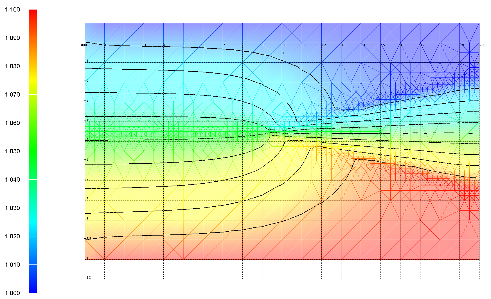
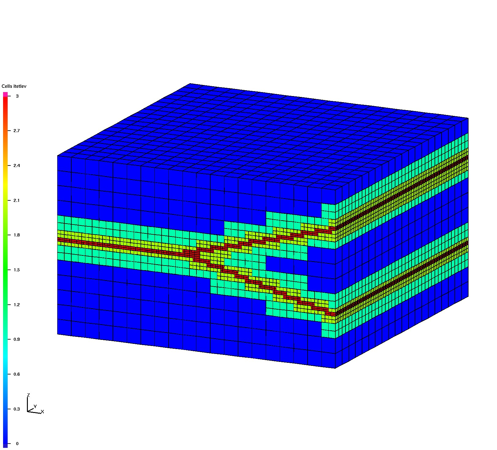
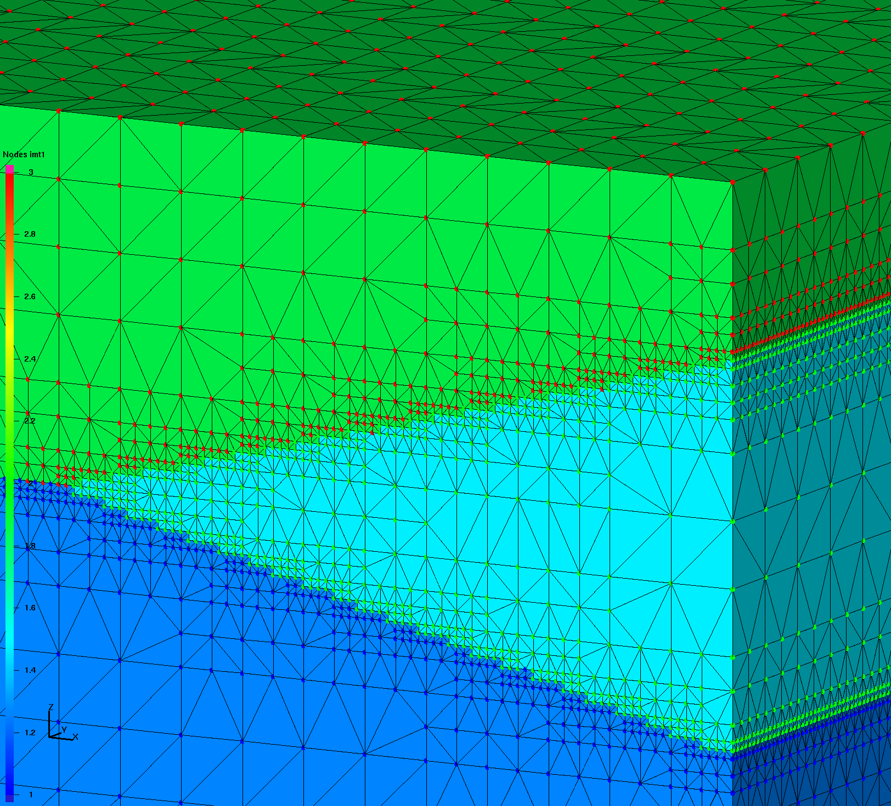
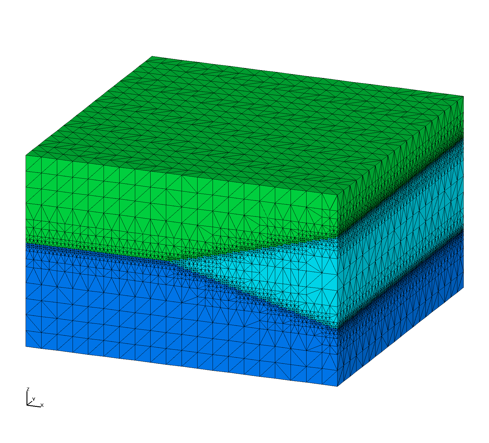

# Image Gallery 

Gallery written: Tue Jul  2 11:31:59 2019

Image Directory: /project/meshing/GEO_Integration/repos/GeologicMeshing/GDSA/Cube_Test02/images

|  |  |  |   | 
| :---: | :---: | :---: | :---:  | 
|  |  |  |   | 
|  **fehm_flow** |  **hex_octree** |  **surfmesh_all_clip** |  **surfmesh_all**  | 
|  |  |  |   | 
|  **tet_delaunay_nodes** |  **tet_delaunay** |  **tet_gfm_ex** |  **tet_gfm_intrf**  | 
|  |  |  |   | 
|  **tet_gfm_nodes** |  **tet_gfm** |  **vorocrust_non_manifold_off** |  **vorocrust_surfmesh_clip**  | 
|  |  |  |   | 
|  **vorocrust_surfmesh**  | 
|   | 

 End Gallery 
End body