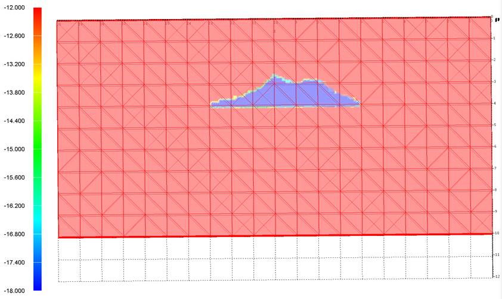
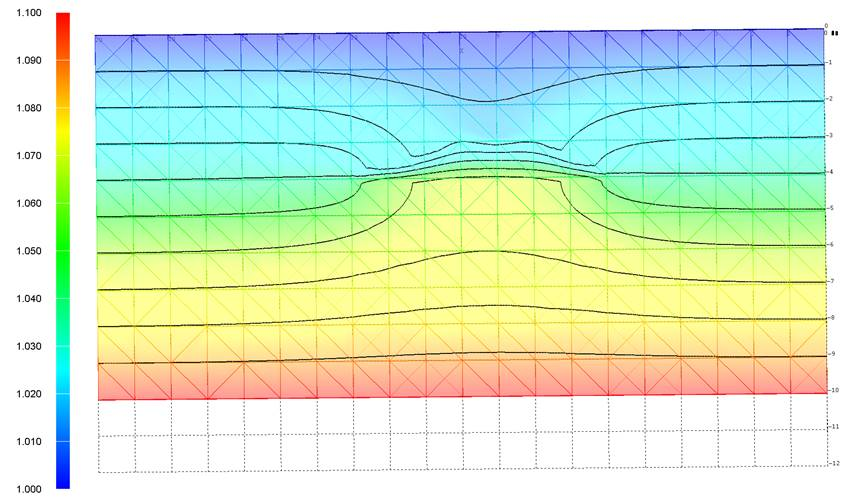
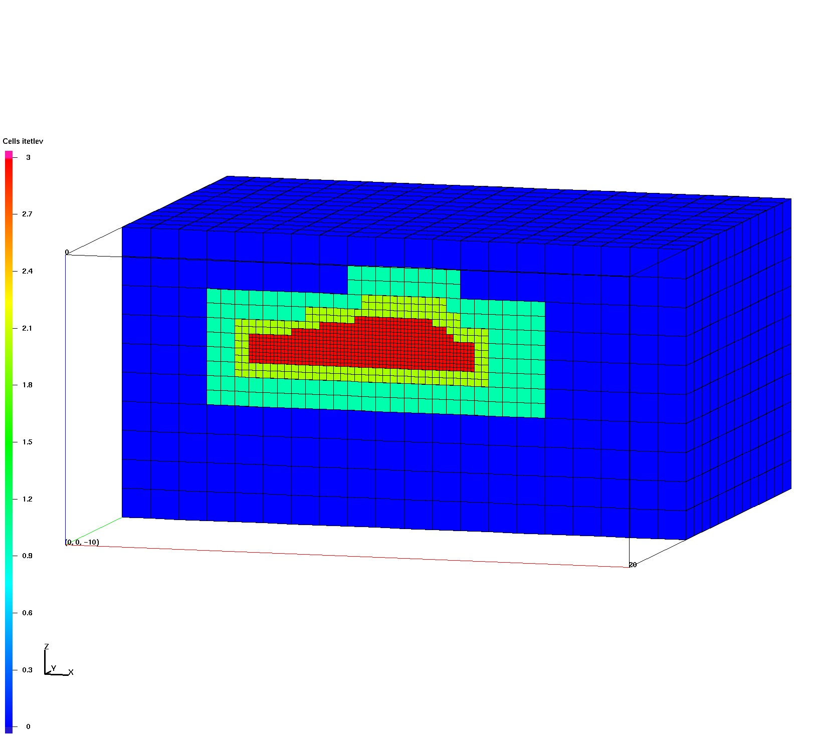
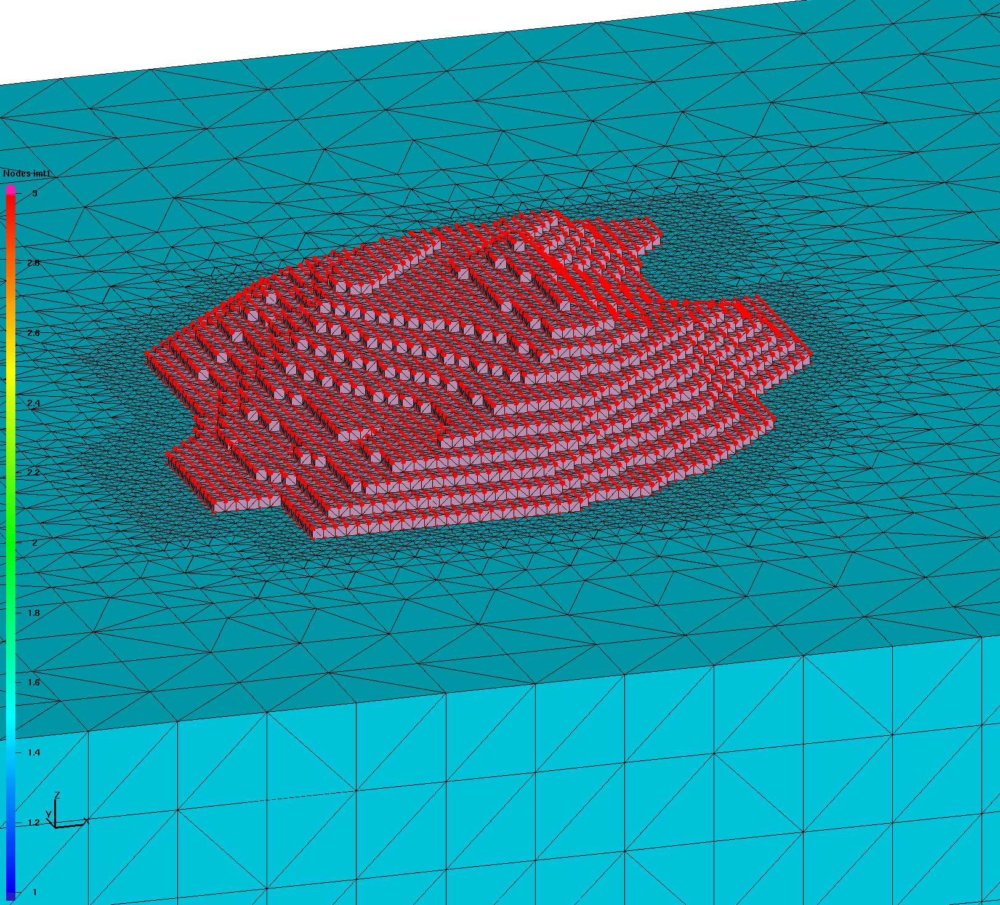
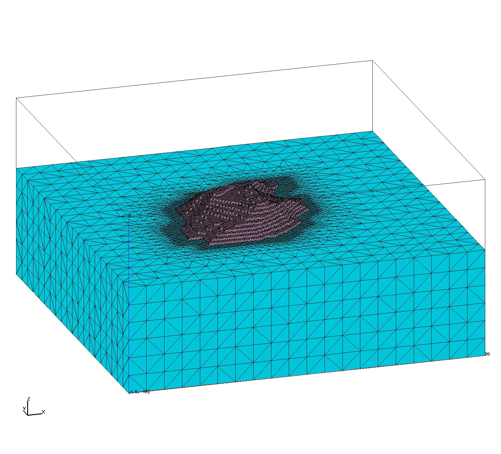

# Image Gallery 

Gallery written: Tue Jul  2 11:30:56 2019

Image Directory: /project/meshing/GEO_Integration/repos/GeologicMeshing/GDSA/Cube_Test03/images

|  |  |  |   | 
| :---: | :---: | :---: | :---:  | 
|  |  |  |   | 
|  **fehm_perm** |  **fehm_pres** |  **hex_octree** |  **tet_delaunay_nodes**  | 
|  |  |  |   | 
|  **tet_delaunay** |  **tet_gfm_ex** |  **tet_gfm_intrf** |  **tet_gfm**  | 
|  |  |  |   | 
|  **vorocrust_non_manifold_off_clip** |  **vorocrust_non_manifold_off** |  **vorocrust_surfmesh_R0.8_clip** |  **vorocrust_surfmesh_R0.8**  | 
|  |  |  |   | 
|  **vorocrust_surfmesh_R1000_clip** |  **vorocrust_surfmesh_R1000**  | 
|  |   | 

 End Gallery 
End body