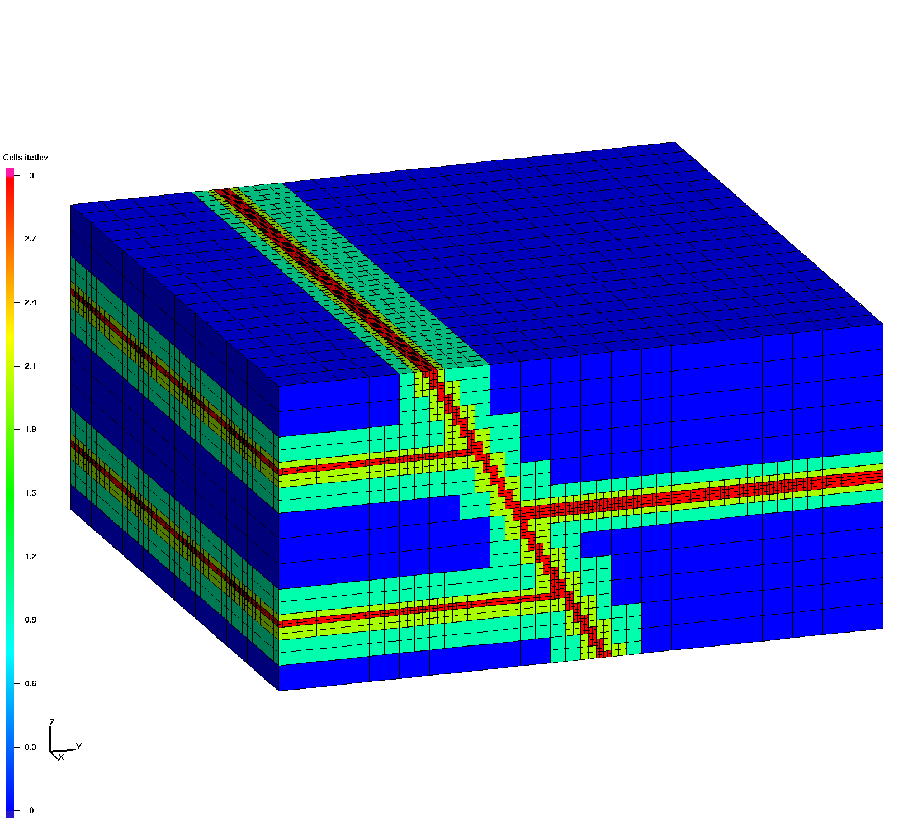

# Image Gallery

Table 1

|  |  |  |
| -------------------- | -------------------- | -------------------- |
| surfmesh_gfm  | surfmesh_gfm_clip  | hex_octree  |
| surfmesh_gfm  | surfmesh_gfm_clip  | hex_octree  |

Tables 2

| surfmesh_gfm | surfmesh_gfm_clip | hex_octree |
| -------------------- | -------------------- | -------------------- |
|   |   |   |

| surfmesh_gfm | surfmesh_gfm_clip | hex_octree |
| -------------------- | -------------------- | -------------------- |
|   |   |   |

Tables 3

| | | |
| :---: | :---: | :---: |
| surfmesh_gfm | surfmesh_gfm_clip | hex_octree |
|   |   |   |
| surfmesh_gfm | surfmesh_gfm_clip | hex_octree |
|   
|   
|   
|

Table 4

| | | |
| :---: | :---: | :---: |
|   |   |   |
| surfmesh_gfm | surfmesh_gfm_clip | hex_octree |
|   |   |   |
| surfmesh_gfm | surfmesh_gfm_clip | hex_octree |

Tables 5

|Image Gallery | this is the date | click for full image |
| :---: | :---: | :---: |
| |  |  |
| surfmesh_gfm | surfmesh_gfm_clip | hex_octree |
|   |   |   |
| surfmesh_gfm | surfmesh_gfm_clip | hex_octree |
|   |   |   |

Tables 6

| | # Image Gallery | |
| :---: | :---: | :---: |
| |  |  |
| **surfmesh_gfm** | **surfmesh_gfm_clip** | **hex_octree** |
|   |   |   |
| **surfmesh_gfm** | **surfmesh_gfm_clip** | **hex_octree** |
|   
|   
|   
|

