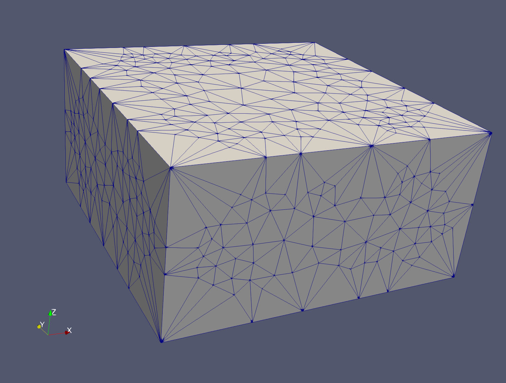

## OneBox stretched 100x100x50

There are three version designed for PFLOTRAN testing with vertical heights of 100, 50, and 1.
Ultimately we want a point source for tracer for the 1 meter high mesh, setting (x,y)=(0,0) and constant pressure boundaries at x=100 and y=100.  

We are going to compare convergence with grid refinement to the analytical solution for 1D radial advection/diffusion of a tracer.  This problem is interesting because it is so simple, but the solution on a structured hex mesh converges incredibly slowly with grid refinement because of grid orientation effects.  This is a universal problem for single-point flux approximation schemes. 

Vorocrust surface:

Vorocrust Interior and Exterior Voronoi Seeds:

Vorocrust Mesh clipped:

Connect into Tets Inside voronoi and surface seeds, vs all voronoi seeds:

 

Files:

VC (vorocrust input and output files):
-rw-r--r--@ 1 tamiller  staff  1221810 Mar 19 11:08 Vmesh_001.ply
-rw-r--r--@ 1 tamiller  staff   343933 Mar 19 11:08 Voronoi_Seeds.csv
-rw-r--r--@ 1 tamiller  staff      302 Mar 19 11:08 corner_spheres.csv
-rw-r--r--@ 1 tamiller  staff     2566 Mar 19 11:08 edges_spheres.csv
-rw-r--r--@ 1 tamiller  staff  1341143 Mar 19 11:08 mesh.uge
-rw-r--r--@ 1 tamiller  staff   926917 Mar 19 11:09 out_mesh.uge
-rw-r--r--@ 1 tamiller  staff    30870 Mar 19 11:08 surface_mesh.obj
-rw-r--r--@ 1 tamiller  staff    43728 Mar 19 11:08 surface_spheres.csv
-rw-r--r--@ 1 tamiller  staff      127 Mar 19 11:08 vc.in

pflotran_tara (pflotran geometric coefs, and boundary files):
-rw-r--r--@ 1 tamiller  staff   14559 Mar 30 08:13 bdry_lgX.ex
-rw-r--r--@ 1 tamiller  staff   16801 Mar 30 08:13 bdry_lgY.ex
-rw-r--r--@ 1 tamiller  staff   15036 Mar 30 08:13 bdry_smX.ex
-rw-r--r--@ 1 tamiller  staff  926928 Mar 30 09:59 out_mesh_edited.uge

pflotran_tara (vorocrust input files):
-rw-r--r--@ 1 tamiller  staff    4595 Mar 30 08:13 2D_voro_z50.in
-rw-r--r--@ 1 tamiller  staff     206 Mar 19 11:07 OneBox_stretched_100x100x50.obj
-rw-r--r--  1 tamiller  staff    5490 Mar 30 11:19 README.txt
-rw-r--r--@ 1 tamiller  staff    4919 Mar 30 09:59 load_voro_mesh_100x100x50.py
-rw-r--r--@ 1 tamiller  staff     127 Mar 19 11:08 vc.in

