# Image Gallery 

Gallery written: Wed Apr  1 17:24:52 2020

Image Directory: /project/meshing/GEO_Integration/repos/GeologicMeshing/GDSA/OneBox_stretch/images

|  |  |  |   | 
| :---: | :---: | :---: | :---:  | 
|  |  |  |   | 
|  **mesh_seeds_clip2** |  **mesh_seeds_clip** |  **mesh_top** |  **surface_sphere_pts**  | 
| 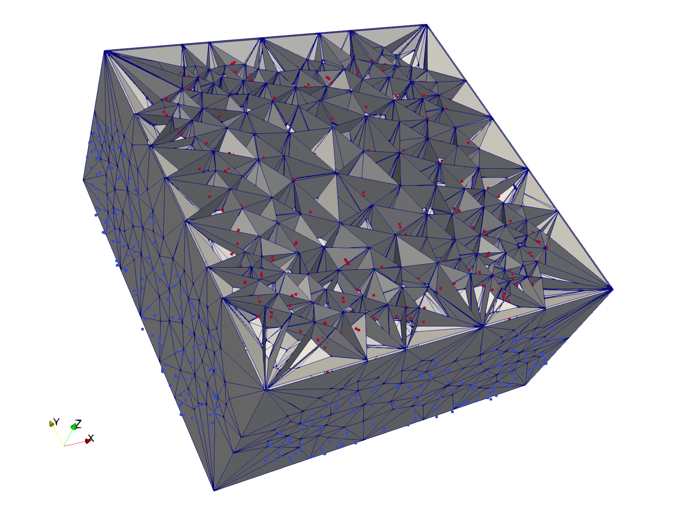 | 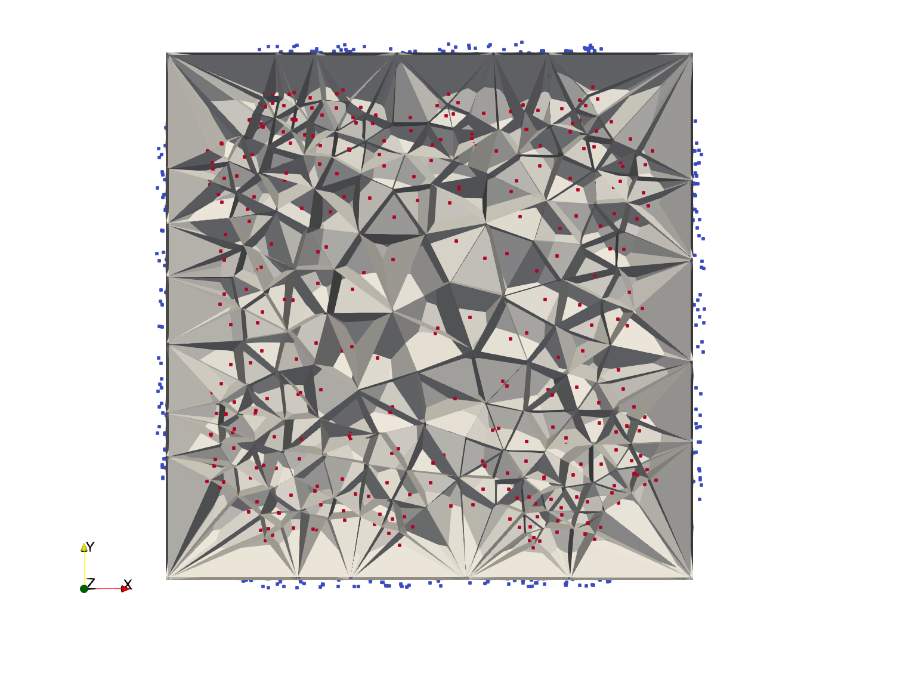 | 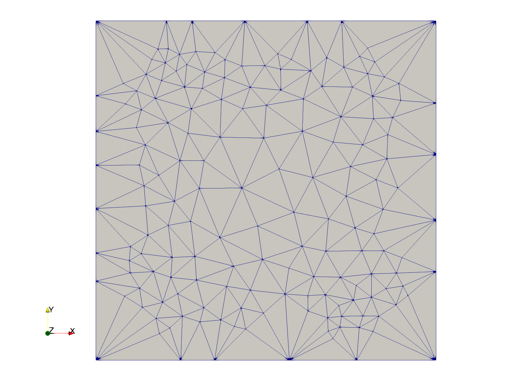 | 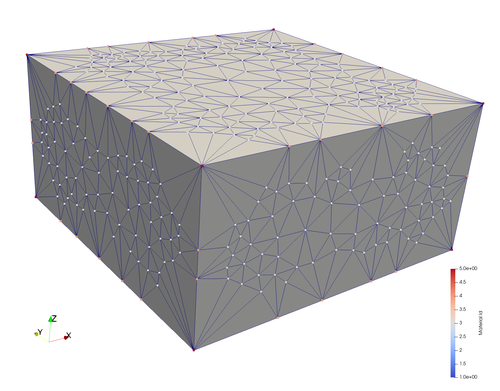  | 
|  **surf_seeds_clip** |  **tet_inseeds_surfpts** |  **tet_seeds_inout** |  **Vmesh.ply**  | 
| 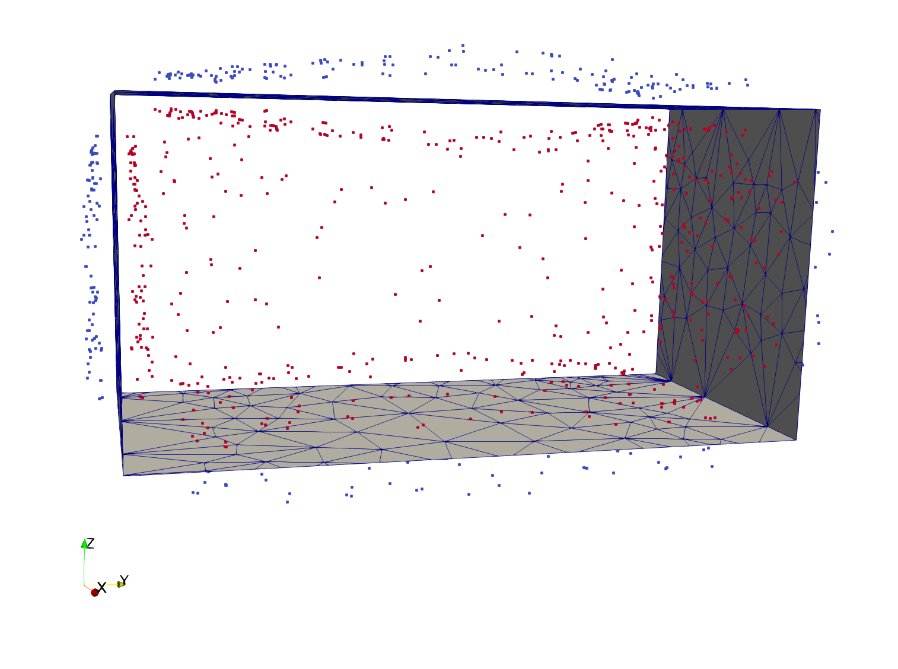 | 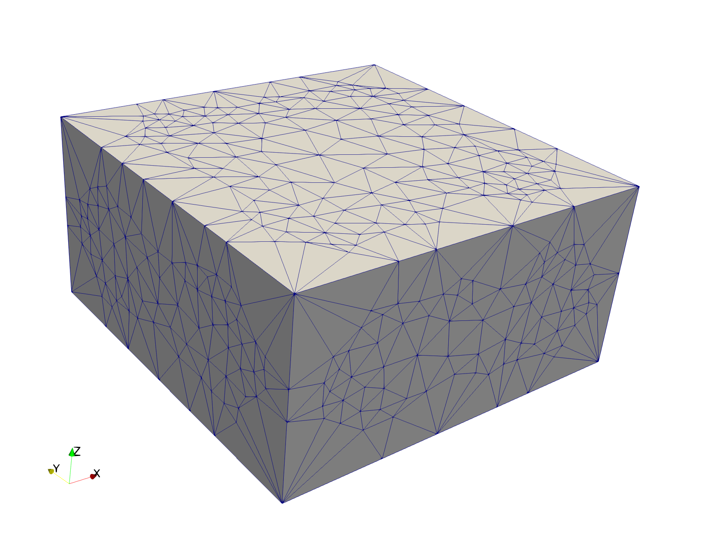 | 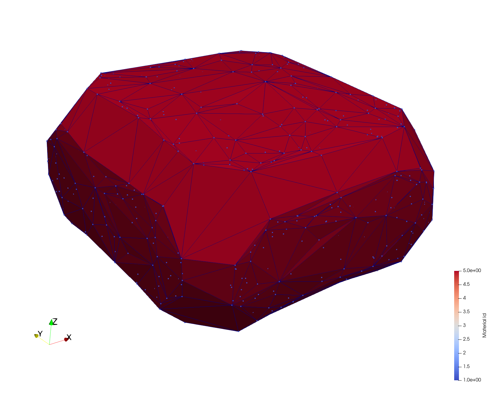 | 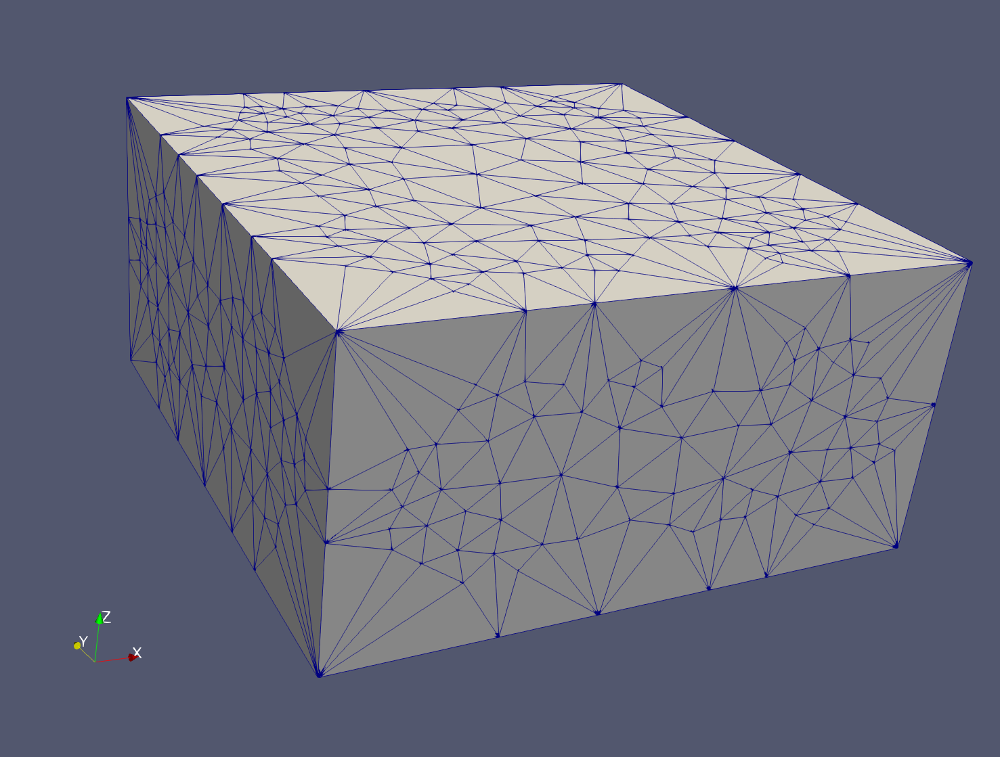  | 
|  **Vmesh_z04** |  **Vmesh_z25** |  **Vmesh_z36** |  **Vmesh_z49**  | 
| 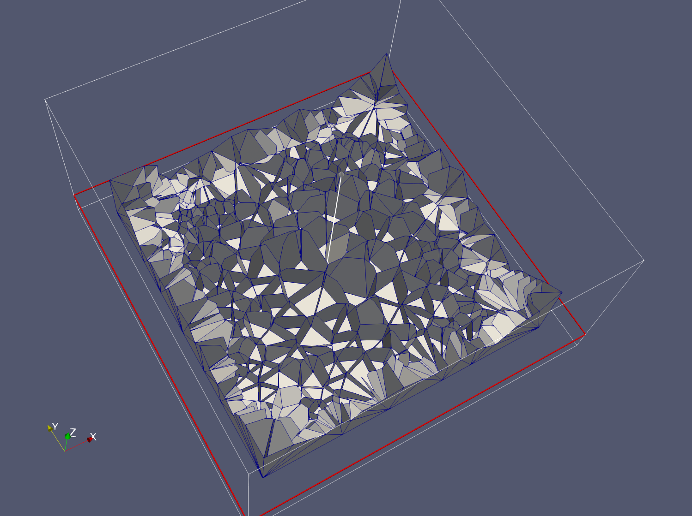 | 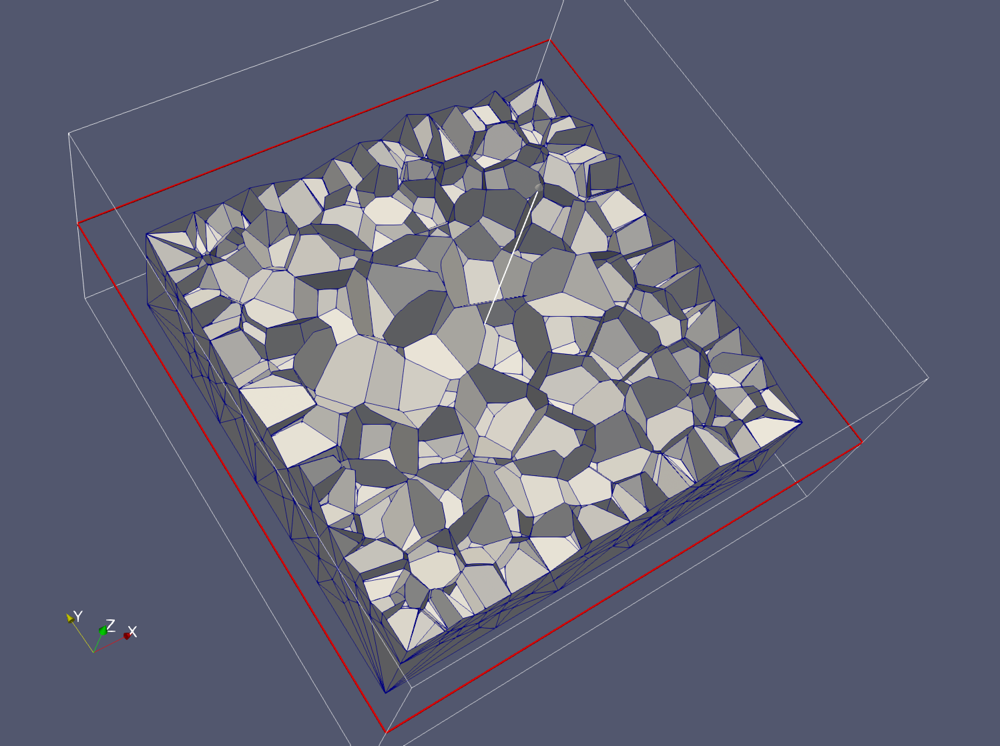 | 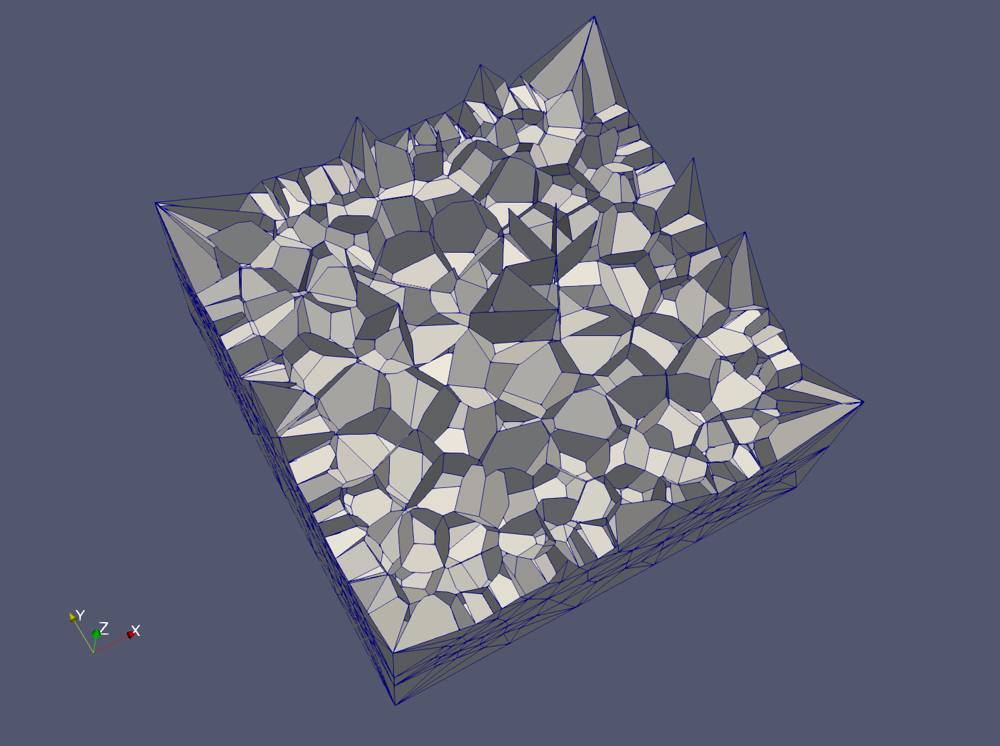 |   | 

End Gallery
